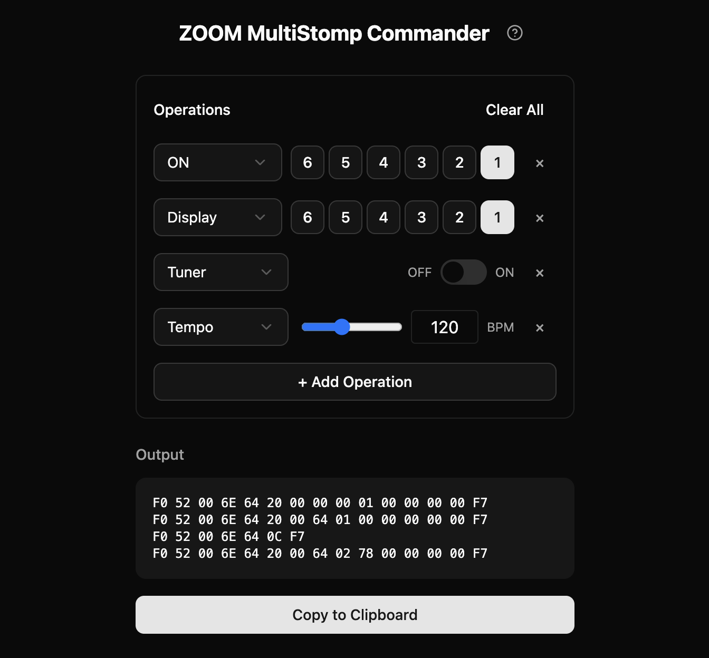

# ZOOM MultiStomp Commander



A web-based tool for generating SysEx commands to control ZOOM MultiStomp series effect pedals via MIDI controllers.

**[Try it out](https://zoom-multistomp-commander.vercel.app/)**

## What is this?

This tool helps you create MIDI SysEx commands for ZOOM MS series pedals (MS-50G+, MS-70CDR+, etc.). You can use these commands with programmable MIDI controllers like M-VAVE Chocolate to remotely control your pedal.

## Features

- **Effector Control** - Turn individual effects ON/OFF or toggle their display
- **Tuner Control** - Enable/disable the built-in tuner
- **Patch Volume** - Adjust the volume level of your patch
- **Tempo Control** - Set the BPM for time-based effects
- **Multi-Operation** - Combine multiple operations into a single SysEx command
- **One-Click Copy** - Copy generated commands to clipboard instantly

## How to Use

1. Visit the [app](https://zoom-multistomp-commander.vercel.app/)
2. Click "+ Add Operation" to add control operations
3. Configure each operation (effect number, ON/OFF, etc.)
4. Copy the generated SysEx command from the Output section
5. Paste the command into your MIDI controller's software

## Tech Stack

- [React](https://react.dev/) 19
- [TypeScript](https://www.typescriptlang.org/)
- [Vite](https://vite.dev/)
- [Tailwind CSS](https://tailwindcss.com/) 4
- [Radix UI](https://www.radix-ui.com/)
- [shadcn/ui](https://ui.shadcn.com/)
- [Playwright](https://playwright.dev/) (E2E Testing)

## Development

```bash
# Install dependencies
pnpm install

# Start development server
pnpm dev

# Run tests
pnpm test

# Build for production
pnpm build
```

## References

This project was made possible thanks to the excellent MIDI protocol documentation from:

- [zoom-explorer](https://github.com/thammer/zoom-explorer) - Comprehensive documentation of ZOOM MS Plus series MIDI/SysEx protocols

## Support

If you find this tool useful, consider buying me a coffee!

[](https://buymeacoffee.com/RyoSogawa)

## License

MIT
